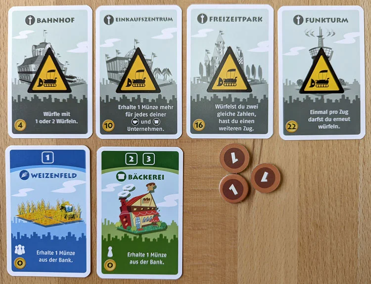
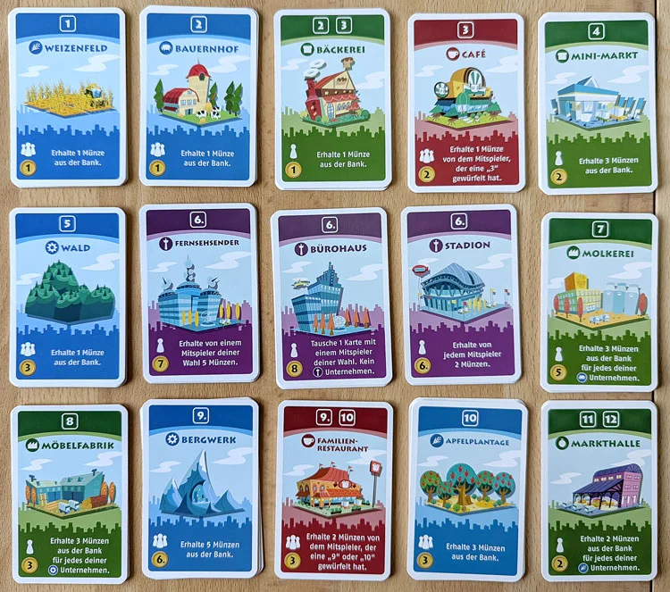

# Machi Koro – Spielregeln (Referenz für die Implementierung)

Quelle: KOSMOS-Anleitung `assets/spielregeln/rules-German.pdf` (Basisspiel, 2014/2015) und die Kartenbilder `Machi-Koro-Spielerauslage.webp` sowie `Machi-Koro-Auslage-zum-Kaufen.webp` im selben Ordner. Diese Datei ist die fachliche Wahrheit für den Code. Bei Widersprüchen gilt die Anleitung, dann ist diese Datei zu korrigieren.

## Glossar (Regelbegriff → Code-Bezeichner)

| Anleitung | Code | Bedeutung |
|---|---|---|
| Spieler | `Player` | 2 bis 4 Teilnehmer |
| Stadt | `City` | Alle Karten, die vor einem Spieler liegen |
| Münze | `Coins` | Immer Wert 1; 5er und 10er sind nur Wechselgeld |
| Bank | `Bank` | Unbegrenzter Münzvorrat |
| Unternehmen | `Establishment` | Kaufbare Karte mit Würfelzahl, Farbe, Branchensymbol, Einkommen, Baukosten |
| Großprojekt | `Landmark` | Eine der vier Karten, die jeder Spieler von Anfang an grau vor sich hat |
| Startkarten | `StartingEstablishments` | Weizenfeld und Bäckerei, Baukosten 0 |
| Auslage | `Supply` | Offene Stapel der Unternehmen in der Tischmitte |
| Würfelzahl | `ActivationNumbers` | Zahl oder Zahlen, bei denen die Karte Einkommen bringt |
| Branchensymbol | `Industry` | Symbol oben links; Grundlage für Kombi-Karten (Molkerei, Möbelfabrik, Markthalle, Einkaufszentrum) |
| Spielersymbol | `Activation` | Einzelne Figur: nur im eigenen Zug. Gruppe: in jedem Zug |
| Farbe | `Category` | Blau, Grün, Rot, Violett |
| Spielzug | `Turn` | Würfeln, Einkommen, Bauen |
| Pasch | `Doubles` | Zwei gleiche Würfel |

## Material

| Komponente | Anzahl |
|---|---|
| Startkarten | 8 (4 Weizenfeld, 4 Bäckerei) |
| Großprojekte | 16 (je 4 Bahnhof, Einkaufszentrum, Freizeitpark, Funkturm) |
| Unternehmen | 84 in 15 Sorten |
| Münzen | 72 (50 × 1, 12 × 5, 10 × 10) |
| Würfel | 2 (sechsseitig) |

Verteilung der 84 Unternehmen: Die Anleitung nennt nur die Summe. Mit 6 Karten je Sorte und 4 Karten je violetter Sorte ergibt sich 12 × 6 + 3 × 4 = 84. Der Code übernimmt diese Verteilung.

## Spielziel

Es gewinnt, wer als Erster alle vier Großprojekte gebaut hat. Das Spiel endet sofort, wenn ein Spieler am Ende seines Zugs sein viertes Großprojekt baut.

## Vorbereitung

1. Jeder Spieler erhält Weizenfeld und Bäckerei (offen), die vier Großprojekte (graue Seite oben, noch nicht gebaut) und 3 Münzen.
2. Alle Unternehmen werden nach Sorte sortiert und offen als Auslage bereitgelegt. Bei weniger als 4 Spielern bleiben Startkarten und Großprojekte gleich, überzählige gehen zurück in die Schachtel. Die Unternehmensauslage wird nicht reduziert.
3. Der jüngste Spieler beginnt, dann im Uhrzeigersinn.

## Ablauf eines Spielzugs

1. **Würfeln.** Mit 1 Würfel. Wer den Bahnhof gebaut hat, wählt vor jedem Wurf zwischen 1 und 2 Würfeln. Bei 2 Würfeln zählt nur die Summe.
2. **Einkommen.** Alle Unternehmen mit der gewürfelten Zahl werden abgewickelt (siehe unten). Mehrfach vorhandene Unternehmen zahlen mehrfach.
3. **Bauen.** Der Spieler darf genau 1 Unternehmen aus der Auslage oder 1 eigenes Großprojekt bauen und zahlt die Baukosten an die Bank. Bauen ist freiwillig.

### Einkommen abwickeln

Reihenfolge nach Anleitung: **Zuerst alle Zahlungen an Mitspieler, erst danach eigenes Einkommen.**

1. **Rot** (Cafés, Restaurants). Der aktive Spieler zahlt an jeden Mitspieler, der ein rotes Unternehmen mit der Zahl besitzt. Reicht sein Geld nicht, zahlt er, was er hat; der Rest verfällt. Bei mehreren Gläubigern wird **gegen den Uhrzeigersinn** ab dem aktiven Spieler bedient.
2. **Blau** (Grundstoffindustrie). Jeder Spieler, der ein blaues Unternehmen mit der Zahl besitzt, erhält aus der Bank. Gilt in jedem Zug, egal wer würfelt.
3. **Grün** (Geschäfte, Fabriken, Markthallen). Nur der aktive Spieler erhält aus der Bank.
4. **Violett** (Besondere Unternehmen). Nur der aktive Spieler; Einkommen kommt von Mitspielern (Stadion, Fernsehsender) oder es ist ein Kartentausch (Bürohaus). Mitspieler zahlen, was sie haben; der Rest verfällt.

Die Reihenfolge Blau, Grün, Violett untereinander legt die Anleitung nicht fest, sie hat auch keine Auswirkung, weil nur Rot und Violett Geld zwischen Spielern bewegen und Violett immer nach Rot kommt. Der Code hält die Reihenfolge Rot, Blau, Grün, Violett ein.

Beispiel aus der Anleitung: A würfelt 3. B hat 3 Cafés, C hat 2 Cafés. A müsste 5 zahlen, hat aber 3. Gegen den Uhrzeigersinn ist C zuerst dran: A zahlt 2 an C, dann 1 an B. B verliert 2.

### Bauregeln

- Von jedem Unternehmen darf ein Spieler beliebig viele Karten besitzen, **außer** von violetten: je höchstens 1 (1 Stadion, 1 Fernsehsender, 1 Bürohaus).
- Ein gebautes Großprojekt wird umgedreht. Sein Vorteil gilt **ab dem nächsten Spielzug** des Spielers, nicht im aktuellen.
- Reihenfolge der Großprojekte ist frei.
- Einsteigervariante (optional, nicht Standard): höchstens 2 Karten je Unternehmen.

## Unternehmen (Auslage)

Farbe: B = Blau, G = Grün, R = Rot, V = Violett. Aktivierung: „selbst“ = nur im eigenen Zug, „alle“ = in jedem Zug. Kosten in Münzen.

| Würfel | Name | Farbe | Branche | Aktivierung | Effekt | Kosten |
|---|---|---|---|---|---|---|
| 1 | Weizenfeld | B | Weizen | alle | 1 Münze aus der Bank | 1 (Startkarte 0) |
| 2 | Bauernhof | B | Kuh | alle | 1 Münze aus der Bank | 1 |
| 2–3 | Bäckerei | G | Geschäft | selbst | 1 Münze aus der Bank | 1 (Startkarte 0) |
| 3 | Café | R | Tasse | Mitspieler würfelt | 1 Münze vom Spieler, der die 3 gewürfelt hat | 2 |
| 4 | Mini-Markt | G | Geschäft | selbst | 3 Münzen aus der Bank | 2 |
| 5 | Wald | B | Zahnrad | alle | 1 Münze aus der Bank | 3 |
| 6 | Stadion | V | Turm | selbst | 2 Münzen von jedem Mitspieler | 6 |
| 6 | Fernsehsender | V | Turm | selbst | 5 Münzen von einem Mitspieler eigener Wahl | 7 |
| 6 | Bürohaus | V | Turm | selbst | Tausche 1 eigenes Unternehmen gegen 1 Unternehmen eines Mitspielers eigener Wahl. Keine Turm-Karten. | 8 |
| 7 | Molkerei | G | Fabrik | selbst | 3 Münzen aus der Bank je eigenem Kuh-Unternehmen | 5 |
| 8 | Möbelfabrik | G | Fabrik | selbst | 3 Münzen aus der Bank je eigenem Zahnrad-Unternehmen | 3 |
| 9 | Bergwerk | B | Zahnrad | alle | 5 Münzen aus der Bank | 6 |
| 9–10 | Familien-Restaurant | R | Tasse | Mitspieler würfelt | 2 Münzen vom Spieler, der die 9 oder 10 gewürfelt hat | 3 |
| 10 | Apfelplantage | B | Weizen | alle | 3 Münzen aus der Bank | 3 |
| 11–12 | Markthalle | G | Obst | selbst | 2 Münzen aus der Bank je eigenem Weizen-Unternehmen | 2 |

Branchensymbole und ihre Träger:

| Branche | Karten |
|---|---|
| Weizen | Weizenfeld, Apfelplantage |
| Kuh | Bauernhof |
| Zahnrad | Wald, Bergwerk |
| Geschäft | Bäckerei, Mini-Markt |
| Tasse | Café, Familien-Restaurant |
| Fabrik | Molkerei, Möbelfabrik |
| Obst | Markthalle |
| Turm | Stadion, Fernsehsender, Bürohaus |

Beim Bürohaus-Tausch wechseln nur die Karten, keine Münzen. Turm-Karten (violett) sind vom Tausch ausgeschlossen.

## Großprojekte

Jeder Spieler besitzt alle vier von Beginn an ungebaut. Vorteil gilt ab dem Zug nach dem Bau.

| Name | Kosten | Vorteil |
|---|---|---|
| Bahnhof | 4 | Vor jedem Wurf frei wählen: 1 oder 2 Würfel. |
| Einkaufszentrum | 10 | Für jedes aktivierte eigene Unternehmen mit Branche **Tasse** oder **Geschäft** 1 Münze mehr. Beispiel: 2 Bäckereien bringen 4 statt 2, 1 Familien-Restaurant bringt 3 statt 2. |
| Freizeitpark | 16 | Wer mit 2 Würfeln einen Pasch wirft, erhält einen vollständigen zweiten Spielzug (würfeln, Einkommen, bauen). Ein Pasch im zweiten Zug gibt keinen dritten. Setzt praktisch den Bahnhof voraus. |
| Funkturm | 22 | Einmal pro Zug darf der Spieler seinen Wurf wiederholen, mit derselben Anzahl Würfel. Es zählt nur der zweite Wurf. |

Wechselwirkungen, die der Code abbilden muss:

- Freizeitpark und Funkturm: Der Wiederholungswurf zählt als der Wurf des Zugs. Ergibt er einen Pasch, greift der Freizeitpark.
- Einkaufszentrum wirkt pro aktivierter Karte, nicht pro Einkommensbetrag. Beim Familien-Restaurant wird der Bonus vom zahlenden Spieler getragen (3 statt 2).
- Einkaufszentrum wirkt nicht auf Molkerei, Möbelfabrik, Markthalle (Branche Fabrik bzw. Obst) und nicht auf blaue oder violette Karten.

## Spielende

Sobald ein Spieler am Ende seines Zugs das vierte Großprojekt baut, endet das Spiel sofort mit seinem Sieg. Ein Freizeitpark-Zusatzzug findet dann nicht mehr statt.

## Variante „Komme, was wolle“ (optional, nicht im ersten Umfang)

Statt 15 sortierter Stapel gibt es einen gemischten Nachziehstapel. Aufgedeckt wird, bis 10 verschiedene Unternehmen ausliegen; gleiche Karten werden gestapelt. Sinkt die Auslage nach einem Kauf auf 9 Sorten, wird nachgezogen bis wieder 10. Zu dritt wird von jedem violetten Unternehmen 1 Karte entfernt, zu zweit 2 Karten. Ist der Stapel leer, wird nicht mehr ergänzt.

## Offene Punkte für die Implementierung

- Die Kartenverteilung 6/4 ist aus der Gesamtzahl abgeleitet, nicht wörtlich in der Anleitung.
- Die Anleitung sagt nicht, ob der Fernsehsender-Spieler einen Mitspieler ohne Münzen wählen darf. Der Code erlaubt jede Wahl; es fließt dann, was vorhanden ist.
- Bürohaus: Die Anleitung sagt nicht, ob der Tausch verpflichtend ist. Der Code behandelt ihn als freiwillig (der Spieler darf verzichten).

## Bilder

Spielerauslage zu Beginn (vier graue Großprojekte, Weizenfeld, Bäckerei, 3 Münzen):

Alle 15 Unternehmen der Auslage:

